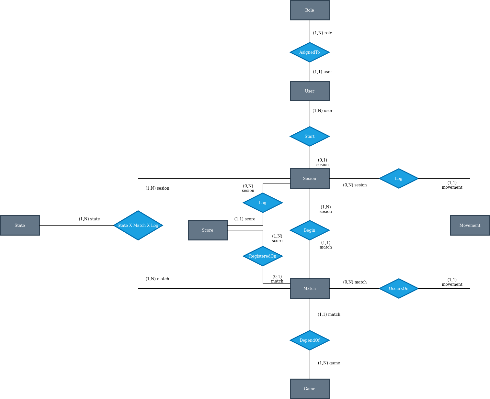
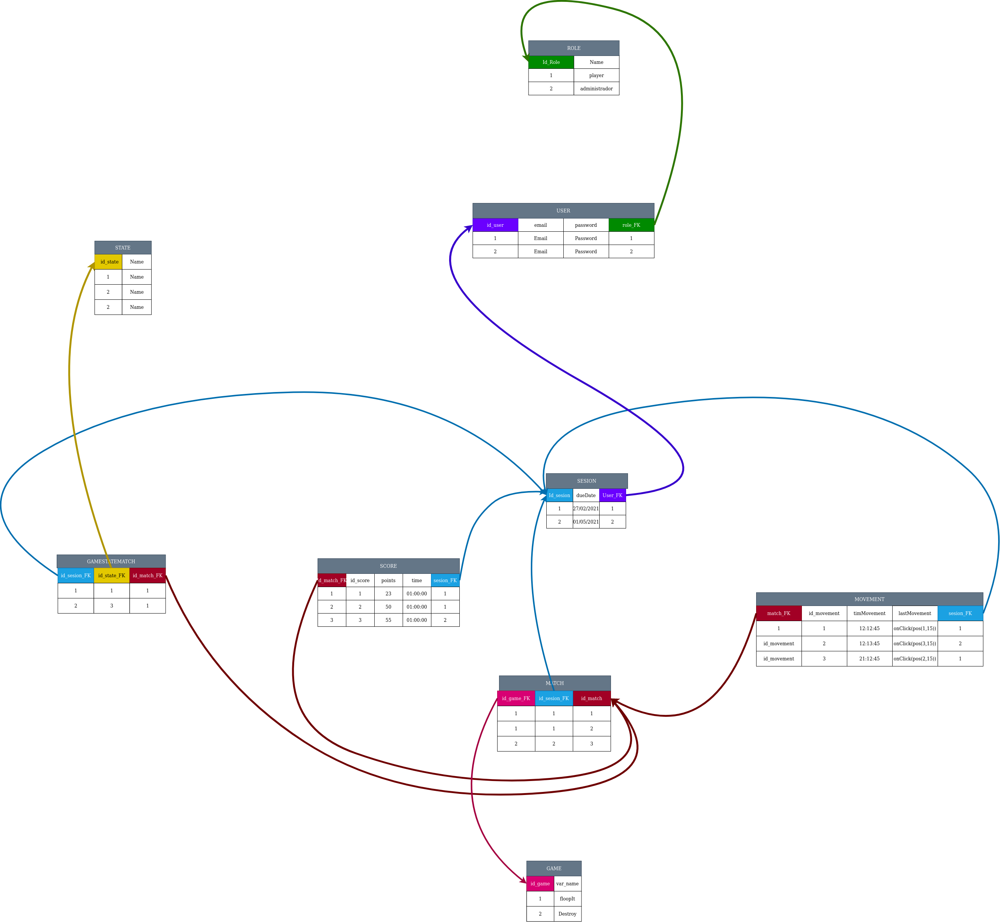

@author roberto.duran@unah.hn, mruizq@unah.hn, fernando.murillo@unah.hn, yesenia.espinoza@unah.hn
@version 0.1.0

@date 2021/07/23

Documentación de Análisis
===

En apoyo al diagrama de clases se crea otra version del Diagrama entidad relacion

Para fortalecer el analisis se crea otro diagrama con base a tuplas o instancias

Antes de comenzar con el analisis conceptual se realizo pruebas sobre el modelo actual al generar consultas utilizando el diagrama con base a tuplas.

