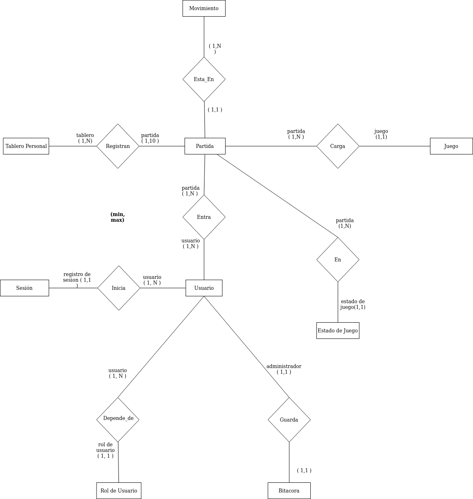
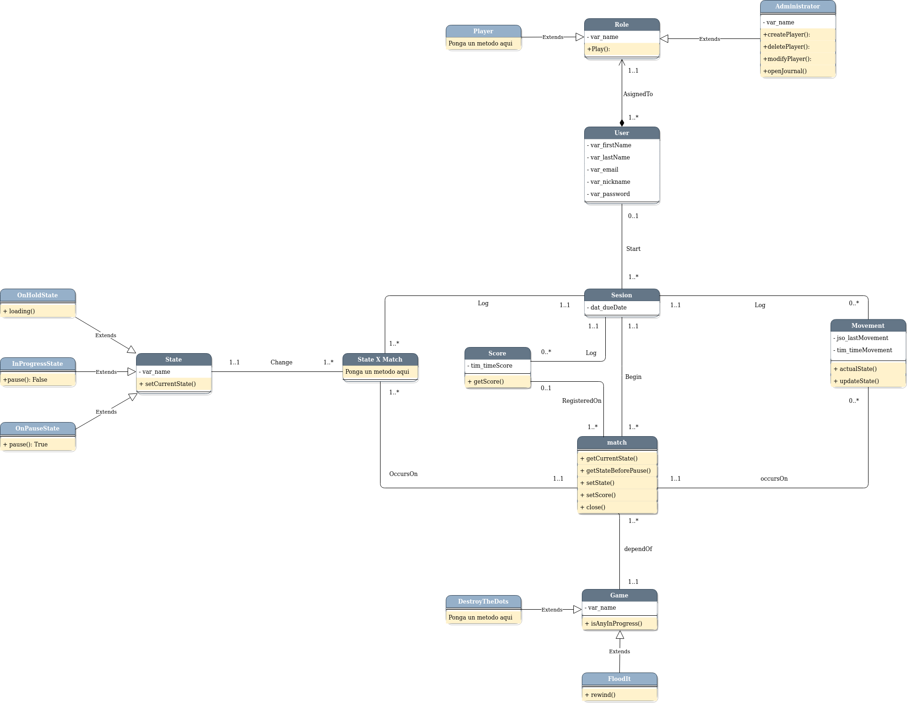
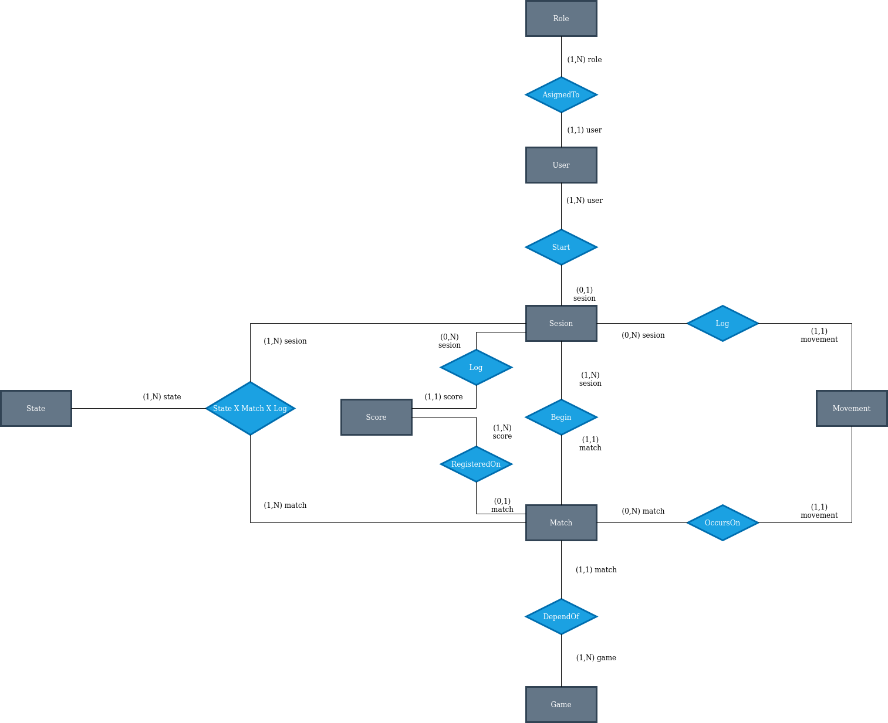
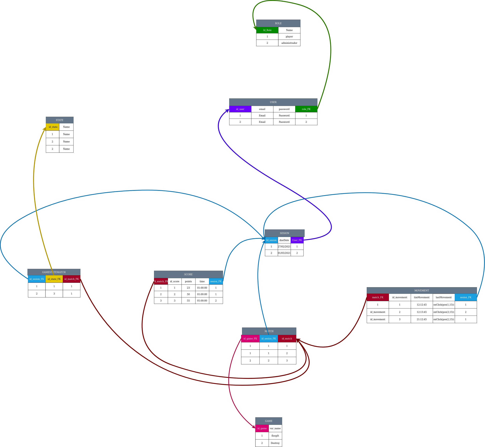
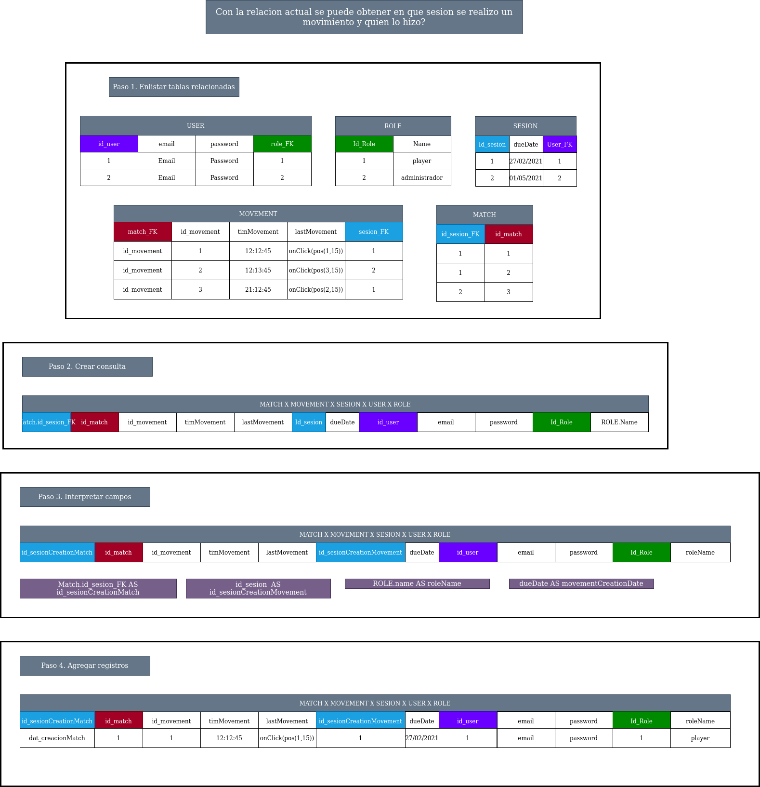
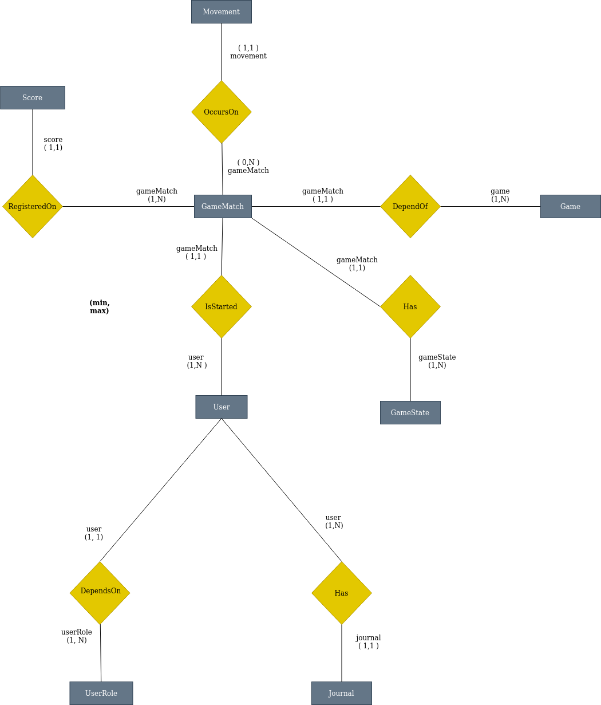
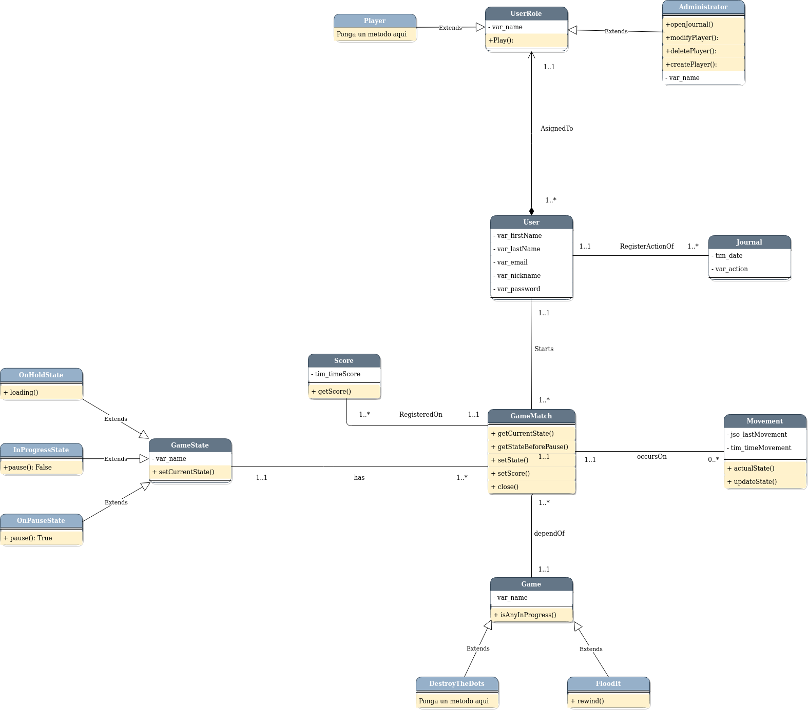

@author roberto.duran@unah.hn, mruizq@unah.hn, fernando.murillo@unah.hn, yesenia.espinoza@unah.hn
@version 0.1.0

@date 2021/07/15

Analisis conceptual utilizando lenguaje natural
===

## Entidades
Se identifican los siguientes tipos entidades:

- Usuario
- Rol de usuario(Administrador y jugador)
- Registro de inicio de sesión(Log): registra cuando un usuario .previamente autenticado inicia sesión.
- ***Registro de Autenticación: Registra cuando un nuevo usuario se identifica dentro de la plataforma.***
- Juego(flood it ó destroy)
- Partida de juego: almacena tiempo de inicio y final de juego.
- Tablero personal: Almacena los 10 mejores tiempos de juegos   exitosos de un usuario.
- Bitacora
- Estado de juego (En espera, pausado, en progreso, derrota y terminado)
- Movimientos

Nota: se menciono que se podria usar un tipo de entidad administrador.
  

## Relaciones (relationship)

Se identifican las siguientes relaciones entre las entidades mecionadas anteriormente:

- ***Registro de autenticación : Usuario (1:N)***
- Registro de inicio de sesión : Usuario (1:N)
- Usuario : Rol de usuario (1:1)
- Usuario : Partida de juego (N:N)
- Juego : Partida de juego (1:N)
- Tablero personal : Partida de juego (1:N)
- Partida de juego : Estado de juego (1:1)
- Partida de juego : Movimientos (1:N)
- Bitacora : Usuario (1:N) 

Nota: Se considera que la tabla usuario puede servir como registro de autenticación.

----
----
----
  
@author roberto.duran@unah.hn, mruizq@unah.hn, fernando.murillo@unah.hn, yesenia.espinoza@unah.hn
@version 0.1.0

@date 2021/07/19

Analisis conceptual esquematico
===
Con ayuda del analisis conceptual realizado por medio del lenguaje natural se procede a realizar un nuevo analisis conceptual haciendo uso del lenguaje esquematico:
- Diagrama Entidad Relacion

 
Diagrama Entidad Relacion (version 1)
----

Este diagrama entidad relacion corresponde a la primera version propuesta del analisis conceptual que servira como base para cumplir con todos los requisitos del proyecto

----
----
----
  
@author roberto.duran@unah.hn, mruizq@unah.hn, fernando.murillo@unah.hn, yesenia.espinoza@unah.hn
@version 0.1.0

@date 2021/07/21

Propuesta analisis conceptual esquematico version 2
===
Se continuo el diseno de recursos correspondientes al analisis conceptual del proyecto.
  

Se planteo una nueva version del analisis conceptual con el objetivo de cumplir con todos los requisitos relacionados con la visualizacion de la bitacora dentro del modulo administrador. No se encontro una forma de cumplir dicho requisito mediante el analisis conceptual de la version anterior, la cual se le llamara version 1 y a esta de forma correlativa se le llamara version 2.
 
La propuesta consiste en modificar la tabla Sesion de tal forma que esta sirva como conexion o puente hacia las tablas cuyo registros se puedan considerar como acciones del usuario

 
Diagrama de clases UML (version 2)
----

Este diagrama de clases corresponde a una version 2 del analisis conceptual propuesto para resolver los requisitos del proyecto

Durante el proceso de diseno se detecto lo siguiente:
----
- En el Diagrama Entidad Relacion se asigno incorrectamente la cardinalidad entre algunas relaciones.
- En el Diagrama Entidad Relacion se encontro una relacion incorrecta entre la tabla bitacora y Usuario administrador, ya que de acuerdo a los requisitos, como tal, un usuario administrador no guarda registros de bitacora, en cambio si debe ser capaz de visualizar dichos registros.

Sobre el proceso de diseno se destaca lo siguiente:
----
- Se hizo uso del concepto de generalizacion para mostrar como clases separadas a los tipos de entidades que corresponden a los roles de usuario, juegos y estados de juego.
- Se realizo un estudio para la correcta asignacion de cardinalidad en el diagrama de clases.
- En contraste con el Diagrama entidad relacion, Se modifico la clase Sesion la cual corresponde a la tabla Sesion en el Diagrama entidad relacion, esto con el fin de normalizar el campo "fecha de creacion"; Se diseno una dependencia a la tabla Sesion en cada tabla de la cual se requiera conocer la fecha de creacion para cada registro.
- Se planifica que la tabla Sesion sirva como puente para obtener todos los datos necesarios que permitan visualizar la bitacora en el modulo administrador
----
----

   
@author roberto.duran@unah.hn, mruizq@unah.hn, fernando.murillo@unah.hn, yesenia.espinoza@unah.hn
@version 0.1.0

@date 2021/07/23

Diagrama ER (version 2)
===

Con base al diagrama de clases version 2 se disena un correspondiente diagrama ER

Diagrama con base a tuplas (version 2)
----
Para fortalecer el analisis conceptual se disena un diagrama con base a tuplas o instancias

Prueba de analisis
----
Antes de terminar con el analisis conceptual se realizan pruebas sobre el analisis conceptual version 2, generando consultas que utilizan el diagrama con base a tuplas.

----
----
----
   

@author roberto.duran@unah.hn, mruizq@unah.hn, fernando.murillo@unah.hn, yesenia.espinoza@unah.hn
@version 0.1.0

@date 2021/07/27

Uso de Triggers para el poblado de la tabla Bitacora
===

Se planteo el uso de triggers para poblar la tabla bitacora, esto con el objetivo de disenar un nuevo modelo ER y diagrama de clases que fuese mas compacto y que tuviese una menor dependencia de tablas y relaciones. Esto implica la eliminacion de la tabla Sesion y la creacion de una nueva tabla llamada Bitacora.

El plan consiste en que cada tabla que representa una accion del usuario, como por ejemplo la tabla Movimiento o la tabla Partida, tenga su propio trigger el cual se activa despues de cada insercion en dicha tabla. Cuando se activa el trigger, este inserta los datos correspondientes en una tabla Bitacora que llevara el registro de algunas o todas las acciones del usuario.

Notas
----
- Al eliminarse la tabla Sesion el modelo resulta casi identico al diagrama ER de la version 1 del analisis conceptual.
- Se reutilizo el diagrama ER version 1 y se realizo correciones en algunas relaciones, detalles de cardinalidad y nombres de tablas.
- Se designo a este nuevo analisis como la version 3.
- Se diseno el diagrama de clases correspondiente a esta nueva version.

Diagrama ER (version 3)
----

Diagrama de clases (version 3)
----

----
----
----

   
@author roberto.duran@unah.hn, mruizq@unah.hn, fernando.murillo@unah.hn, yesenia.espinoza@unah.hn
@version 0.1.0

@date 2021/08/07

Algoritmo de ponderacion o peso para el puntaje de cada partida
===

La tabla de Score muestra los 10 puntajes mas altos de un usuario dentro de la aplicacion. Dicha aplicacion ofrece 2 juegos, de los cuales se registra un puntaje al terminar cada partida exitosamente. Estos juegos son:
- Destroy the dots.
- Flood It.

<b>El puntaje de ambos juegos se registra en la misma tabla. Para tener un equilibrio en el puntaje de ambos juegos el algoritmo de ponderacion se encarga de evaluar dichos puntajes dependiendo del juego.</b> Se tiene en consideracion los parametros que agregan y quitan peso al puntaje final, de forma que el puntaje final depende de 2 o mas parametros y dichos parametros tienen un efecto distinto en el puntaje de cada juego.

 
Sobre las condiciones de juego
----
----
Tanto en Flood It como en Destroy The Dots la partida finaliza exitosamente bajo condiciones diferentes. Tambien el tiempo de transicion entre los moviento de cada juego varia considerablemente. 
En el caso de Destroy The Dots, los movimientos tienden a realizarse en un periodo aproximadamente constante y sin limite de tiempo; La partida finaliza exitosamente cuando el tablero se llena completamente bloqueando la opcion de hacer otro movimiento. En este juego la probabilidad de exito aumenta dependiendo de la destreza y velocidad del jugador para hacer movimientos. 
En el caso de Flood It, los movimientos tienden a realizarse en lapsos de tiempo indeterminado y sin limite de tiempo; La partida finaliza exitosamente cuando el jugador realiza 25 movimientos o cuando el tablero se pinta completamente de un solo color. En este juego la probabilidad de exito aumenta dependiendo de la capacidad analitica del jugador.

 
Sobre las valoraciones:
----
----
- <b>En ambos juegos los parametros que aportan un valor al puntaje son el tiempo y la cantidad de movimientos</b>.
- la habilidad que tiene mayor peso en el juego Flood It es la capacidad analitica, esto debido a que el jugador se enfrenta a escenarios en donde la eleccion del movimiento es clave para obtener un mayor puntaje. Para el juego Flood It la cantidad de movimientos es el parametro mas importante para calcular un puntaje final.
- Las habilidades que tienen un mayor peso en el juego Destroy The Dots son la velocidad, destreza y resistencia; Esto debido al aumento progresivo de la velocidad en que se llena el tablero. Para el juego Destroy The Dots la magnitud del tiempo en que se termina exitosamente la partida es el parametro mas importante para calcular un puntaje final.
- En contraste, el tiempo final en el juego Destroy The Dots tiene mayor peso que en el juego Flood it. Por tanto, decimos que, en el juego Destroy The Dots entre mayor sea el tiempo mejor es el puntaje final, siendo lo contrario en el juego Flood It.  
- En contraste, el numero de movimientos realizados en el juego Flood It tiene mayor peso que en el juego Destroy The Dots. Por tanto en el juego Flood It entre menor sea la cantidad de movimientos mayor sera el puntaje, siendo lo contrario en el juego Destroy The Dots.

 
Tabla de valoraciones
----
<table style="widht:100%;">
 <tr>
    <th>Flood It</th>
    <th>Destroy The Dots</th>
  </tr>
    <tr>
        <td>A mayor tiempo, menor puntaje</td>
        <td>A mayor tiempo, mayor puntaje</td>
    </tr>
    <tr>
        <td>A menor tiempo, mayor puntaje</td>
        <td>A menor tiempo, menor puntaje</td>
    </tr>
    <tr>
        <td>A menor movimiento, mayor puntaje</td>
        <td>A menor movimiento, menor puntaje</td>
    </tr>
    <tr>
        <td>A mayor movimiento, menor puntaje</td>
        <td>A mayor movimiento, mayor puntaje</td>
    </tr>
</table>
 

Implementacion
----
----
Con base a las valoraciones se debe asignar un rango de peso para cada escenario planteado, haciendo uso de pruebas, tanteo y observacion, con el fin de crear una ponderacion razonable y justa para ambos juegos.

Propuesta 1: Flood It
----

<table style="widht:100%;">
 <tr>
    <th>propuesta</th>
  </tr>
    <tr>
        <td>El juego tiene una puntuacion maxima, la cual se obtiene en el caso de que el jugador termine exitosamente la partida en el movimiento 1 con un tiempo de 1 milisegundo (0.001 segundos)</td>
    </tr>
    <tr>
        <td>Teniendo en cuenta que existe un limite de 25 movimientos, se asigna a cada movimiento un puntaje multiplo de mil. Si se termina la partida exitosamente con 1 movimiento el puntaje subtotal es de 25,000. Si se termina la partida exitosamente con 25 movimientos el puntaje subtotal es de 1000.</td>
    </tr>
    <tr>
        <td>El tiempo se convierte a segundos y se divide entre el puntaje subtotal el cual se obtiene segun el numero de movimientos</td>
    </tr>
</table>

Propuesta 1: Destroy The Dots
----

<table style="widht:100%;">
 <tr>
    <th>propuesta</th>
  </tr>
    <tr>
        <td>El juego no tiene un puntuacion maxima, sin embargo el aumento de dificultad con el avance de movimientos se puede considerar como un limitante</td>
    </tr>
    <tr>
        <td>Teniendo en cuenta que no existe un limite de movimientos a cada movimiento se le asigna un puntaje multiplo de 0.01. Si se termina la partida exitosamente con 25 movimientos el puntaje subtotal es de 0.25. Si se termina la partida exitosamente con 60 movimientos el puntaje subtotal es de 0.5</td>
    </tr>
    <tr>
        <td>El tiempo se convierte a segundos y se multiplica por el puntaje subtotal el cual se obtiene segun el numero de movimientos</td>
    </tr>
</table>
 

Formulas
----
----
<table style="widht:100%;">
 <tr>
    <th>Flooid It</th>
    <th>Destroy The Dots</th>
  </tr>
    <tr>
        <td>2500-[(n-1)*1000]/(tiempo en segundos)</td>
        <td>(0.01)(n)(tiempo en segundos)</td>
    </tr>
</table>

----
----
----
   
@author roberto.duran@unah.hn, mruizq@unah.hn, fernando.murillo@unah.hn, yesenia.espinoza@unah.hn
@version 0.1.0

@date 2021/08/15

Elimacion de un usuario en el CRUD del modulo administrador
===

Restriciones en llaves foraneas
----
MySQL admite llaves foraneas, que permiten la referencia cruzada de datos relacionados entre tablas, y restricciones de llaves foraneas, que ayudan a mantener la coherencia de los datos relacionados.

Una relación de llave foranea implica una tabla padre que contiene los valores de la columna inicial y una tabla hija con valores de columna que hacen referencia a los valores de la columna de la tabla padre. 
- Se define una restricción de llave foranea en la tabla hija.

 
Eliminacion o actualizacion de tuplas en tabla con restriccion referencial CONSTRAINT
----
Cuando una operación UPDATE o DELETE afecta a un valor clave en la tabla padre que tiene filas coincidentes en la tabla hija, el resultado depende de la acción referencial especificada por las subcláusulas ON UPDATE y ON DELETE de la cláusula FOREIGN KEY.

 
CASCADE
----
Elimina o actualiza la fila de la tabla padre y elimina o actualiza automáticamente las filas coincidentes en la tabla hija. Se admiten tanto ON DELETE CASCADE como ON UPDATE CASCADE. Entre dos tablas.

 
Problema
----
- Teniendo en cuenta que las acciones de clave foranea en cascada no activan desencadenantes o Triggers, se plantea una forma de realizar una eliminacion en cascada manual haciendo uso de tecnicas, teoria, temas, nomenclatura y conocimientos adquiridos en clases, con el fin de garantizar la activacion del trigger al eliminar un usuario en el modulo administrador, para que dicha accion se registre en la bitacora.

 
Analisis de Solucion
----
- Para eliminar un Usuario se debe eliminar todo registro de tablas foraneas que hagan referencia a dicho usuario.
    - Las tablas que hacen referencia a un usuario pueden ser:
        - Tabla de Bitacora.
        - Tabla de Partida.
- Para eliminar un registro de Bitacora se debe eliminar todo registro de tablas foraneas que hagan referencia a dicho registro.
    - No existen Tablas en el modelo relacional cuyas tuplas hagan referencia a un registro de Bitacora.
- Para eliminar un registro de Partida se debe eliminar todo registro de tablas foraneas que hagan referencia a dicha partida.
    - Las tablas que pueden hacer referencia a una Partida son:
        - Tabla de Puntaje
        - Tabla de Movimiento
- Para eliminar un registro de Puntaje se debe eliminar todo registro de tablas foraneas que hagan referencia a dicho puntaje.
    - No existen Tablas en el modelo relacional cuyas tuplas hagan referencia a un registro de Puntaje.
- Para eliminar un registro de Movimiento se debe eliminar todo registro de tablas foraneas que hagan referencia a dicho movimiento.
    - No existen Tablas en el modelo relacional cuyas tuplas hagan referencia a un registro de Movimento.

 
Implementacion
----
Una opcion para resolver la problematica es la de implementar un procedimiento almacenado que se encarga de verificar la existencia de cada registro relacionado con el usuario a eliminar. En este caso se debe verificar los registros en las tablas Bitacora, Partida, Puntaje y Movimiento de forma que en caso de encontrar registros relacionados con el usuario estos se deben eliminar en un orden especifico antes de eliminar al usuario.

 
Pasos
----
- En el procedimiento almacenado se utiliza un cursor que recorre cada partida creada por el usuario.
- El cursor toma el id de cada partida y lo utiliza para borrar los puntajes y movimientos relacionados a dicho id.
- Luego se eliminan todas las partidas relacionadas con el usuario.
- Despues se elimina cada registro relaciona al usuario de la tabla bitacora.
- Finalmente se elimina el usuario.
